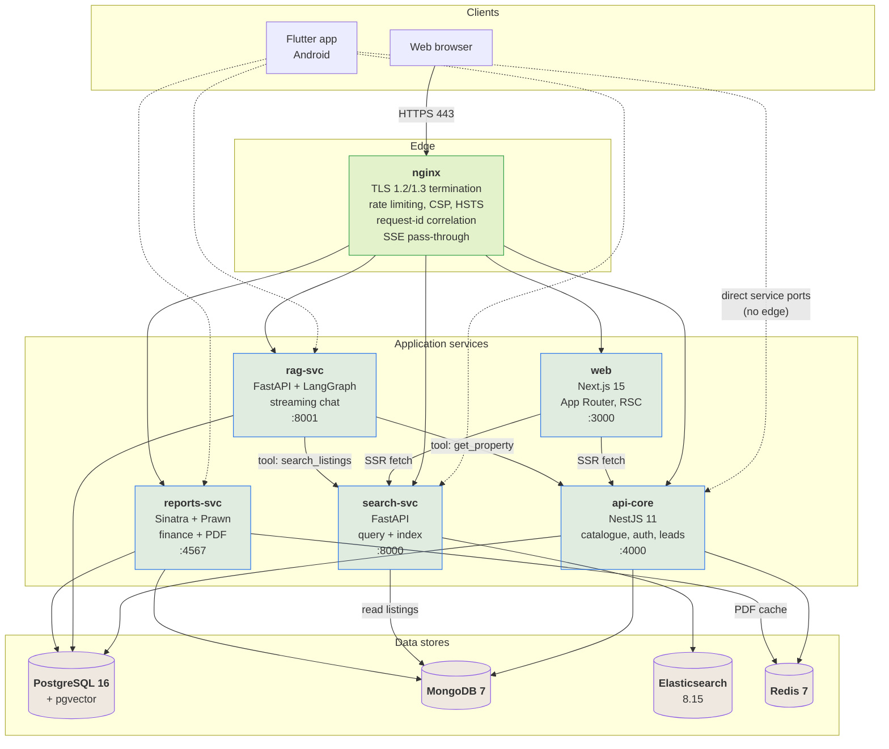
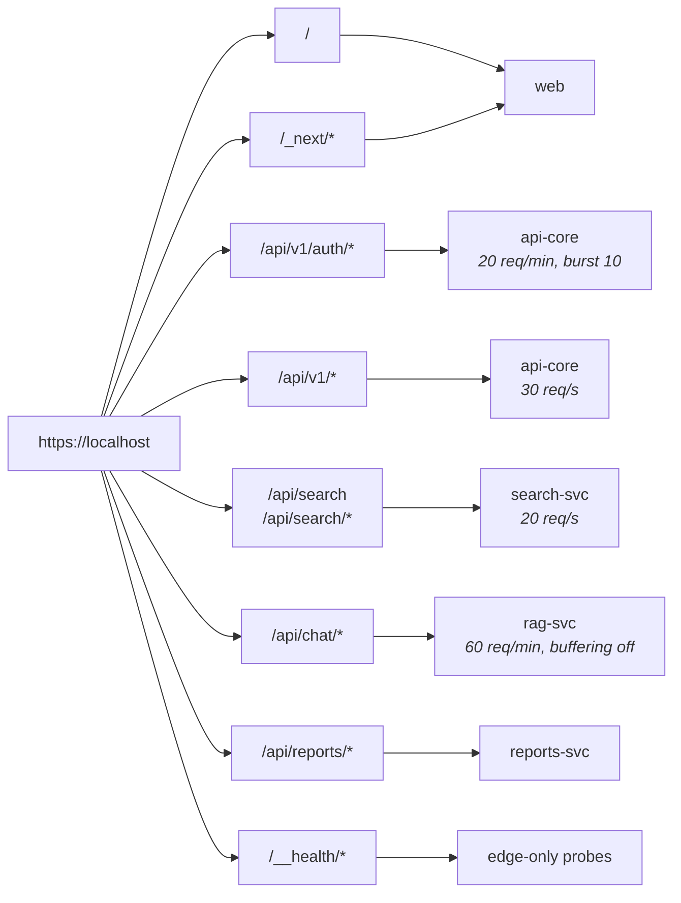
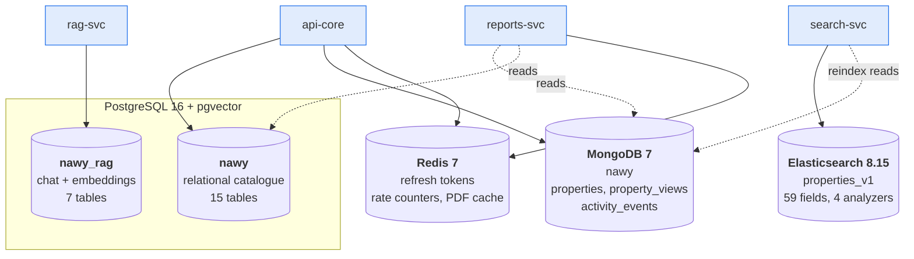
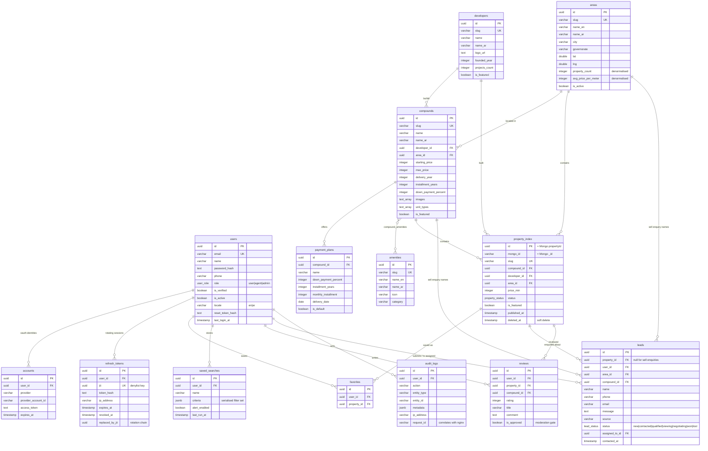
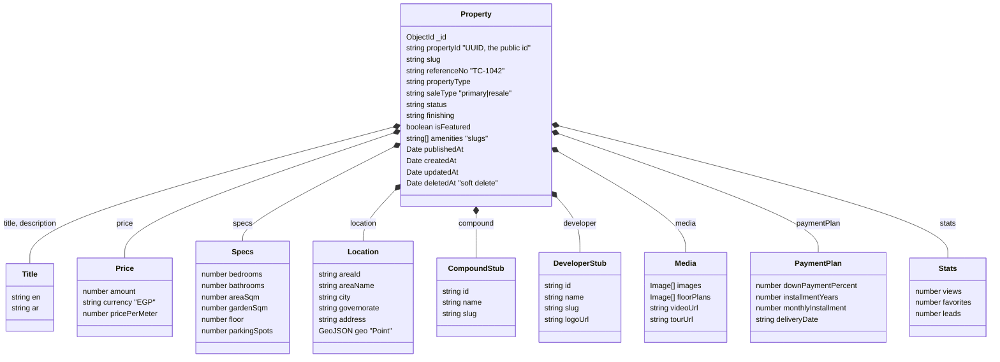
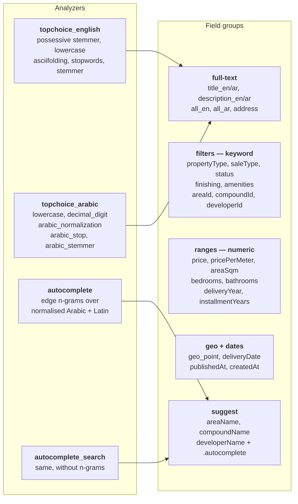
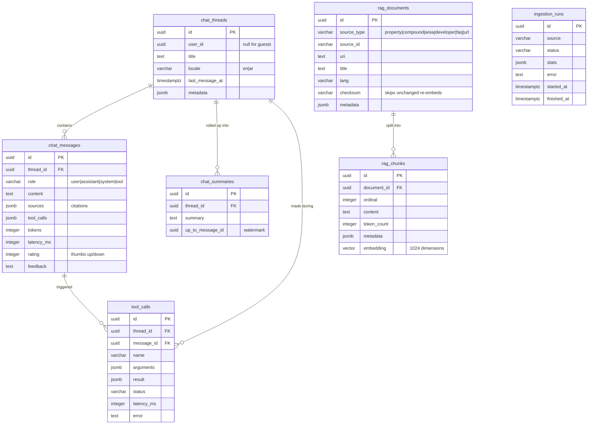
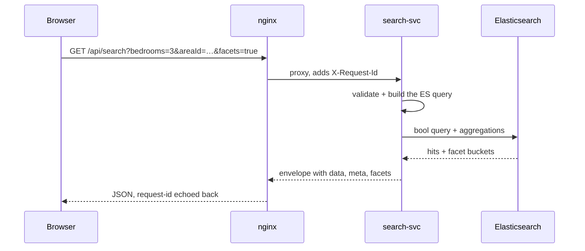
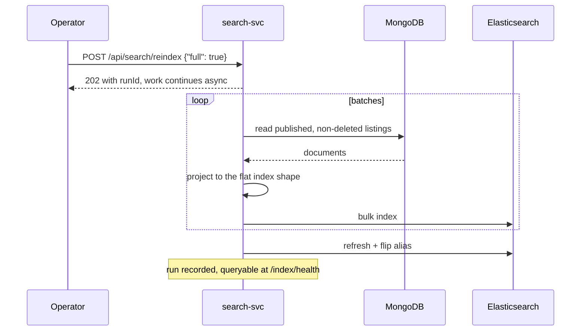
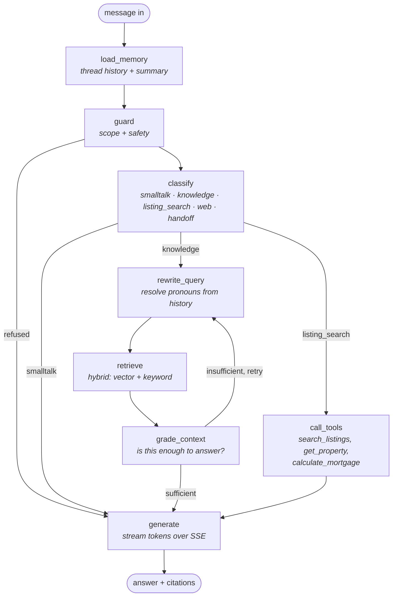

# TopChoice

**Egypt's property marketplace, end to end.**


A production-shaped property marketplace for the Egyptian primary and resale
market, built as a polyglot monorepo that runs end to end with one command.

Browse 180 seeded listings across New Cairo, Sheikh Zayed, the North Coast, the
New Administrative Capital, 6th of October and Mostakbal City from developers
like Palm Hills, SODIC, Emaar Misr, Talaat Moustafa Group, Mountain View, Ora
and Hassan Allam. Filter them through a real Elasticsearch index with Arabic and
English analyzers, price them with a mortgage engine that emits PDF brochures,
and ask a streaming retrieval-augmented chatbot *"what's a 3-bedroom in Sheikh
Zayed under 12M EGP with an 8 year plan?"* — every request arriving over TLS
through a single nginx edge.

```bash
git clone <this-repo> && cd Real-Estate-Platform
make bootstrap                      # ~5-10 min on a cold cache
open https://localhost              # accept the self-signed certificate once
```

---

## Table of contents

- [System architecture](#system-architecture)
- [Request routing](#request-routing)
- [Services](#services)
- [Data architecture](#data-architecture)
- [Database design](#database-design)
  - [PostgreSQL — the relational core](#postgresql--the-relational-core)
  - [MongoDB — the listing documents](#mongodb--the-listing-documents)
  - [Elasticsearch — the search index](#elasticsearch--the-search-index)
  - [pgvector — the RAG store](#pgvector--the-rag-store)
  - [Redis — ephemeral state](#redis--ephemeral-state)
- [Key flows](#key-flows)
- [Quick start](#quick-start)
- [Demo credentials](#demo-credentials)
- [Ports](#ports)
- [Configuration](#configuration)
- [Repository layout](#repository-layout)
- [Testing](#testing)
- [Deployment](#deployment)
- [Troubleshooting](#troubleshooting)

---

## System architecture

Five application services behind one TLS edge, each owning its own data store.
Nothing shares a database: when one service needs another's data it asks over
HTTP, which is what keeps the boundaries honest.



**Why the mobile app bypasses the edge.** The Flutter client talks to each
service on its own port rather than through nginx. On an emulator the host is
`10.0.2.2` and there is no trusted certificate for the self-signed edge, so
going direct avoids shipping a TLS exception in a debug build. Every base URL is
a `--dart-define`, so a real deployment points them all at the public edge.

---

## Request routing

nginx owns every public path. The prefixes are contractual — see
[`docs/CONTRACT.md`](docs/CONTRACT.md) §2 — and a service never sees a path
outside its own namespace.



Auth gets its own tighter bucket because credential stuffing is the attack that
actually happens. `/api/chat/` runs with `proxy_buffering off`, `gzip off` and
`X-Accel-Buffering: no` so chat tokens arrive one at a time rather than in one
lump at the end. Every rate limit, `413`, `502/503` and `504` returns the
contract's JSON error envelope, not an HTML page — a client never has to parse
HTML to discover what went wrong.

---

## Services

| Service | Stack | Owns | Responsibility |
|---|---|---|---|
| **web** | Next.js 15, React 19, Tailwind | — | Storefront and admin. Server components fetch through the same envelope the public API uses. Bilingual EN/AR with RTL. |
| **api-core** | NestJS 11, Prisma, Mongoose | PostgreSQL `nawy`, MongoDB `nawy`, Redis | The catalogue and the system of record. Auth with refresh-token rotation, areas, developers, compounds, amenities, favourites, saved searches, leads, reviews, audit log. |
| **search-svc** | FastAPI, Python 3.12 | Elasticsearch | Query and index. Reads listings from Mongo, projects them into `properties_v1`, serves faceted search and autocomplete in both languages. |
| **rag-svc** | FastAPI, LangGraph | PostgreSQL `nawy_rag` (pgvector) | Retrieval-augmented chat over SSE. Owns threads, messages, summaries, the document/chunk store and its embeddings; calls the other services as tools. |
| **reports-svc** | Sinatra, Ruby 3.3, Prawn | — (reads Mongo + PG) | The finance engine: mortgage and installment maths, market aggregation, CSV exports and PDF brochures. Caches rendered PDFs in Redis. |

---

## Data architecture

Four stores, each chosen for what it is actually good at, and one clear owner
per store.



**Why listings live in Mongo and everything else in Postgres.** A listing is a
deep, bilingual, irregularly-shaped document — nested price, specs, location,
media arrays, an embedded payment plan, denormalised compound and developer
stubs. Modelling that relationally means a dozen joins to render one card. The
catalogue around it — users, areas, developers, leads, favourites — is
genuinely relational and wants foreign keys and transactions, so it stays in
Postgres.

**The bridge between them** is `property_index`, a thin Postgres projection of
each listing carrying only what a foreign key needs to point at: the UUID, the
Mongo ObjectId, the slug, and the few columns other tables filter on. It is what
lets `favorites.property_id` and `leads.property_id` be real relational columns
without dragging the whole document into Postgres.

---

## Database design

### PostgreSQL — the relational core

Database `nawy`, owned by api-core, managed with Prisma migrations.



Three details worth calling out:

- **`refresh_tokens.replaced_by_jti`** makes rotation auditable. Each refresh
  mints a new token and points the old row at it, so replaying a spent token is
  detectable rather than merely rejected — the whole chain can be revoked.
- **`leads.property_id` is nullable.** A "sell my property" enquiry names an
  area, a compound and a property type instead of an existing listing, so those
  three columns carry it.
- **`property_index.deleted_at`** is the soft-delete tombstone every consumer
  filters on. A hard delete would orphan favourites and leads that legitimately
  reference a withdrawn listing.

### MongoDB — the listing documents

Database `nawy`, collection `properties`. One document is everything needed to
render a listing page without a join.



The `compound` and `developer` stubs are deliberately denormalised copies of the
Postgres rows. A listing card needs the compound name and the developer logo;
fetching those over HTTP per card would be absurd, and they change rarely enough
that a reindex is the right refresh mechanism.

`property_views` and `activity_events` sit alongside as append-only collections,
kept out of Postgres because they are high-write and nothing joins against them.

### Elasticsearch — the search index

Index `properties_v1` behind the alias `properties`, projected from Mongo. 59
fields, four custom analyzers.



`all_en` and `all_ar` are copy-to catch-alls, so a single query string matches a
compound name, an area, a developer or the description without the caller
enumerating fields. The alias indirection is what makes a zero-downtime reindex
possible: build `properties_v2`, then flip the alias.

### pgvector — the RAG store

Database `nawy_rag`, owned by rag-svc. Conversation state and the embedded
corpus live together so a thread and its citations are one transaction.



`rag_documents.checksum` is what makes re-ingestion cheap: a document whose
content hash has not moved is skipped rather than re-embedded. `chat_summaries`
carries a watermark so a long thread is compacted incrementally instead of being
re-summarised from the top every turn.

### Redis — ephemeral state

Nothing in Redis is a source of truth; it is all reconstructible.

| Namespace | Written by | Purpose |
|---|---|---|
| `auth:refresh:<jti>` | api-core | Refresh-token denylist. A rotated or revoked `jti` lands here until its natural expiry, so a stolen token dies before the JWT does. |
| `cache:prop:<id>:<v>` | reports-svc | Rendered PDF brochures, keyed by property and template version. |
| rate-limit counters | search-svc, reports-svc | Per-caller windows for the service-level limits that sit behind nginx's. |

---

## Key flows

### Search



Facets are opt-in (`facets=true`) so an ordinary results page does not pay for
fifteen aggregations it will not render.

### Indexing



### Retrieval-augmented chat

The LangGraph state machine behind `/api/chat/message`:



`grade_context` is the loop that stops the model answering from thin retrieval:
if the chunks do not support an answer it rewrites the query and tries again, up
to a bounded number of iterations, rather than confabulating.

---

## Quick start

```bash
make bootstrap
```

That one command creates `.env` with freshly generated secrets, issues a
self-signed TLS certificate, builds every image, waits for health, seeds the
catalogue, builds the Elasticsearch index and ingests the RAG corpus.

Then:

```bash
make health      # probe every service through TLS
make ps          # container status
make logs        # tail everything
make down        # stop, keeping volumes
```

The chatbot answers from the knowledge base without any model key. Set
`OPENAI_API_KEY` (and optionally `DASHSCOPE_API_KEY` for embeddings) in `.env`
to get generated prose instead of rendered tool output.

---

## Demo credentials

| Role | Email | Password |
|---|---|---|
| admin | `admin@topchoice.local` | `TopChoice@Demo123` |
| agent | `agent@topchoice.local` | `TopChoice@Demo123` |
| user | `buyer@topchoice.local` | `TopChoice@Demo123` |

---

## Ports

Every published host port is overridable, because a machine that already runs
Postgres on 5432 should still be able to start this stack. Set any of these in
`.env`; the container-side ports and all service-to-service URLs are unaffected.

| Service | Public path | Host port | Override |
|---|---|---|---|
| nginx | `https://localhost` | 80, 443 | `HTTP_HOST_PORT`, `HTTPS_HOST_PORT` |
| web | `/` | 3000 | `WEB_HOST_PORT` |
| api-core | `/api/v1/*` | 4000 | `API_CORE_HOST_PORT` |
| search-svc | `/api/search*` | 8000 | `SEARCH_SVC_HOST_PORT` |
| rag-svc | `/api/chat/*` | 8001 | `RAG_SVC_HOST_PORT` |
| reports-svc | `/api/reports/*` | 4567 | `REPORTS_SVC_HOST_PORT` |
| postgres | — | 5432 | `POSTGRES_HOST_PORT` |
| mongo | — | 27017 | `MONGO_HOST_PORT` |
| redis | — | 6379 | `REDIS_HOST_PORT` |
| elasticsearch | — | 9200 | `ELASTIC_HOST_PORT` |

`https://localhost/__health/<service>` probes each backend *through* TLS without
colliding with any application route.

---

## Configuration

Every value lives in `.env`, created from [`.env.example`](.env.example) by
bootstrap. Names are contractual — see [`docs/CONTRACT.md`](docs/CONTRACT.md) §7
— so do not rename them.

| Group | Keys |
|---|---|
| Secrets | `JWT_ACCESS_SECRET`, `JWT_REFRESH_SECRET`, `INTERNAL_SERVICE_TOKEN` |
| Datastores | `DATABASE_URL`, `MONGO_URL`, `REDIS_URL`, `ELASTICSEARCH_URL` |
| Service URLs | `API_CORE_URL`, `SEARCH_SVC_URL`, `RAG_SVC_URL`, `REPORTS_SVC_URL` |
| Models | `OPENAI_API_KEY`, `DASHSCOPE_API_KEY` |
| Public | `NEXT_PUBLIC_SITE_URL`, `NEXT_PUBLIC_*_URL` |
| Host ports | `*_HOST_PORT` (see above) |

---

## Repository layout

```
.
├── apps/
│   ├── web/            Next.js 15 storefront and admin
│   ├── mobile/         Flutter client (Android)
│   ├── api-core/       NestJS: catalogue, auth, leads
│   ├── search-svc/     FastAPI: Elasticsearch query + index
│   ├── rag-svc/        FastAPI + LangGraph: streaming chat
│   └── reports-svc/    Sinatra: finance, CSV, PDF
├── infra/
│   ├── nginx/          TLS edge, routing, rate limits
│   ├── terraform/      AWS: VPC, ECS, RDS, DocumentDB, OpenSearch, CloudFront
│   └── scripts/        bootstrap, certs, health
├── seed/               The catalogue: 180 listings, compounds, areas, developers
├── docs/CONTRACT.md    The API contract every service is held to
└── docker-compose.yml
```

---

## Testing

```bash
make test              # every suite
```

| Component | Tests | Runner |
|---|---|---|
| api-core | 84 | Jest |
| web | 39 | Vitest |
| mobile | 33 | `flutter test` |
| search-svc | 90 | pytest |
| rag-svc | 197 | pytest |
| reports-svc | 199 | RSpec |

Static analysis runs alongside: ESLint and `tsc` for TypeScript, ruff and mypy
for Python, RuboCop for Ruby, `flutter analyze --fatal-infos` for Dart, and
`terraform fmt`/`validate` for the infrastructure.

Two workflows gate `main`: **CI** (lint, typecheck, test, image build, compose
smoke test) and **Security** (npm audit, pip-audit, bundler-audit, Gitleaks, and
Trivy across the filesystem, secrets and IaC).

---

## Deployment

`infra/terraform` provisions the AWS side: VPC with public/app/data tiers, ECS
Fargate services behind an ALB, RDS PostgreSQL, DocumentDB, ElastiCache,
OpenSearch, S3 plus CloudFront for media, Secrets Manager, and a customer-
managed KMS key per store.

```bash
cd infra/terraform/bootstrap && terraform init && terraform apply   # once per account
cd .. && terraform init -backend-config=environments/prod.backend.hcl
terraform plan
```

Release signing for the mobile app reads `apps/mobile/android/key.properties`,
which is gitignored — copy `key.properties.example` and generate a keystore.

---

## Troubleshooting

**The browser warns about the certificate.** It is self-signed. Accept it once,
or trust it system-wide with the instructions in
`infra/scripts/gen-certs.sh`.

**A port is already in use.** Set the matching `*_HOST_PORT` in `.env` and
`make up` again. Nothing internal depends on the host-side number.

**Search returns `SEARCH_BACKEND_ERROR`.** Check `make health` and then the
cluster: `curl localhost:9200/_cluster/health`. A red cluster on a full disk is
the usual cause — Elasticsearch stops allocating shards near its watermark. The
compose file already pushes those out for a single-node dev cluster; free some
disk and it recovers.

**The chatbot answers but never streams.** SSE needs buffering off end to end.
Confirm with `curl -skN https://localhost/api/chat/stream/<id>` and look for
`content-type: text/event-stream` and `x-accel-buffering: no`.

**nginx returns 502 after recreating a container.** nginx resolves upstream
names at start. Run `make restart` if a backend's IP changed.

---

## License

MIT.
